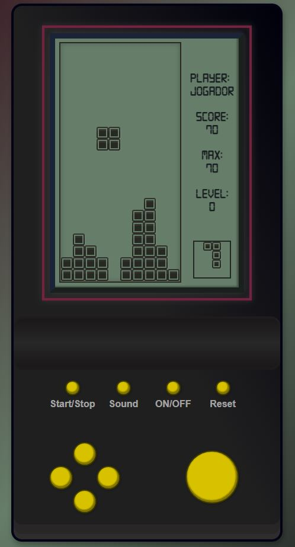

# Mini game Tetris

## Link para o game deployado
https://compassionate-montalcini-429a2f.netlify.app/

## Link para a publicação no Medium
https://gavs2.medium.com/mini-projeto-de-engenharia-de-software-2887853c2f85
## Contexto Geral
Projeto da cadeira de Engenharia de Software para aprender sobre HTML, CSS e lógicas de JavaScript fazendo o clássico Tetris!
  

  

  

## Funcionalidades
 - Botão ON/OFF para ligar ou desligar o video game.
 - Botão Start/Stop para iniciar o jogo ou dar um pause.
 - Botão Sound para ligar ou desligar a música do jogo.
 - Botão Reset para resetar a fase do zero.
 - A velocidade do jogo escala de acordo com as pontuações do usuário.

## Detalhes do Jogo
- O nome do player fica salvo depois da primeira vez que o usuário colocar no input.
- O valor de Highest Score fica salvo para sempre no navegador do usuário, ou seja, o valor é persistente.
## Time

|  Yuri Barros <ycb@cin.ufpe.br>|  Giovani Albuquerque <gavs2@cin.ufpe.br>|  Yuri Alencar <yral@cin.ufpe.br>|  Daniel Turmina <dft@cin.ufpe.br> |  Victor Barros <vbmn@cin.ufpe.br>|
|-|-|-|-|-|